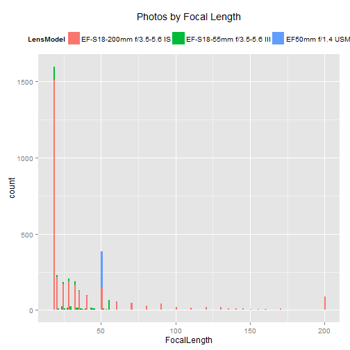
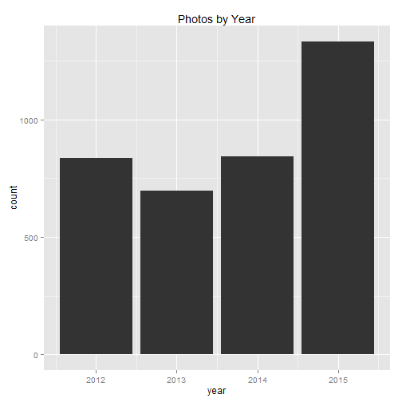

Load the already cleaned data

```r
data <- readRDS("data.rds")
summary(data)
```

```
##       ISO         CreateDate                     Aperture   
##  100    :1678   Min.   :2012-08-07 10:32:52   3.5    : 409  
##  200    : 512   1st Qu.:2013-03-05 16:49:50   5.6    : 408  
##  400    : 465   Median :2014-05-06 09:24:40   8.0    : 352  
##  800    : 395   Mean   :2014-04-13 17:57:28   9.0    : 334  
##  3200   : 275   3rd Qu.:2015-07-11 16:18:02   10.0   : 286  
##  1600   : 114   Max.   :2015-10-24 08:49:09   4.0    : 282  
##  (Other): 268                                 (Other):1636  
##   ShutterSpeed   FocalLength                         LensModel   
##  1/200  : 526   Min.   : 18.00   EF-S18-200mm f/3.5-5.6 IS:3020  
##  1/250  : 323   1st Qu.: 18.00   EF-S18-55mm f/3.5-5.6 III: 450  
##  1/160  : 290   Median : 23.00   EF50mm f/1.4 USM         : 237  
##  1/125  : 269   Mean   : 37.12                                   
##  1/30   : 256   3rd Qu.: 40.00                                   
##  1/40   : 229   Max.   :200.00                                   
##  (Other):1814
```

```r
nrow(data)
```

```
## [1] 3707
```

Histogram of pictures by focal length:


```r
ggplot(data, aes(FocalLength)) + 
    geom_histogram(aes(fill = LensModel), binwidth = 1) +
    theme(legend.position = "top") +
    labs(title = "Photos by Focal Length")
```

 

Bar plot of pictures by year


```r
byYear <- data %>%
    group_by(year = year(CreateDate)) %>%
    summarise(count = n())

ggplot(byYear, aes(x = year, y = count)) +
    geom_bar(stat = "identity") +
    labs(title = "Photos by Year")
```

 
